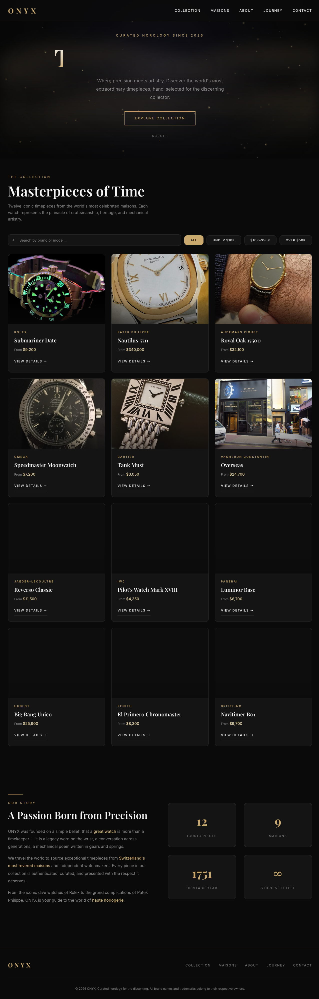

# ONYX — Curated Horology



A luxury watch showcase website featuring 12 iconic timepieces from 9 legendary maisons.

## Pages

- **Collection** (`index.html`) — Hero with aurora gold effect + 12 watches with filter/search + detail modals
- **Maisons** (`brands.html`) — 9 brand directory with rich modals (history, models, milestones)
- **About** (`about.html`) — Story, values, timeline, stats
- **Journey** (`journey.html`) — Articles and insights
- **Contact** (`contact.html`) — Contact form + info cards + consultation hours

## Design

- Dark obsidian + gold theme
- Playfair Display + Inter fonts
- Unique hero effects per page (aurora canvas, sweep line, typewriter, shimmer, pulse)
- Responsive layout
- Real watch photography from Wikimedia Commons

## Serve

```bash
cd onyx && python3 -m http.server 8080 --bind 0.0.0.0
```

Visit `http://localhost:8080`
